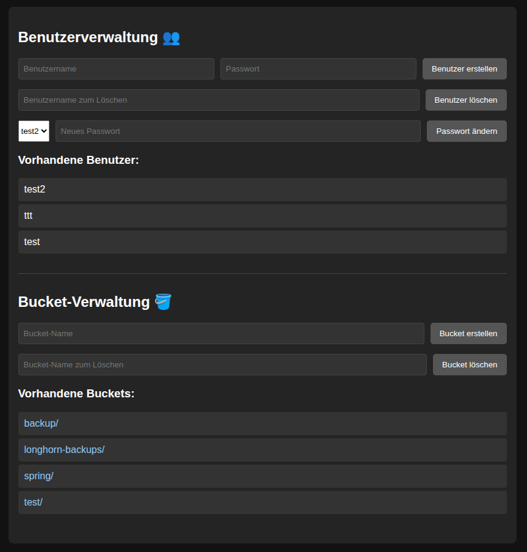
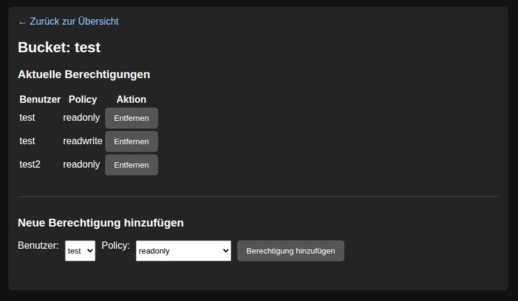

# simple minio web manager for minio community edition
* uses mc client for access to the admin api
* provides management of
  * users
  * buckets
  * ACLs

## Screenhots



## get uv - makes python life easier
```
curl -LsSf https://astral.sh/uv/install.sh | sh
```

## run
```
uv sync
uv run uvicorn main:app --host 0.0.0.0 --port 9002
```

### from scratch
- uv lock --upgrade
- uv sync
- uv run ruff check .
- uv run pyright .
- uv run pytest
- uv pip compile pyproject.toml -o requirements.txt
- uv run uvicorn main:app --reload

### get local mc client
```
sh getclient.sh
```

## Docker build
```
docker build -t minioweb .
```

## set env vars
```
export MINIO_ACCESS_KEY=xxxxxx
export MINIO_SECRET_KEY=xxxxxx
export MINIO_ENDPOINT=https://gmk.lan:9000
export MINIO_ALIAS=gmk
```

## Docker run
```
docker run --rm -p 9002:9002 \
  -e MINIO_ACCESS_KEY=$MINIO_ACCESS_KEY \
  -e MINIO_SECRET_KEY=$MINIO_SECRET_KEY \
  -e MINIO_ENDPOINT=$MINIO_ENDPOINT \
  -e MINIO_ALIAS=$MINIO_ALIAS \
  minioweb
```

## Docker run daemon
```
docker run --name minioweb -d -p 9002:9002 \
  -e MINIO_ACCESS_KEY=$MINIO_ACCESS_KEY \
  -e MINIO_SECRET_KEY=$MINIO_SECRET_KEY \
  -e MINIO_ENDPOINT=$MINIO_ENDPOINT \
  -e MINIO_ALIAS=$MINIO_ALIAS \
  --restart unless-stopped wlanboy/minioweb
```